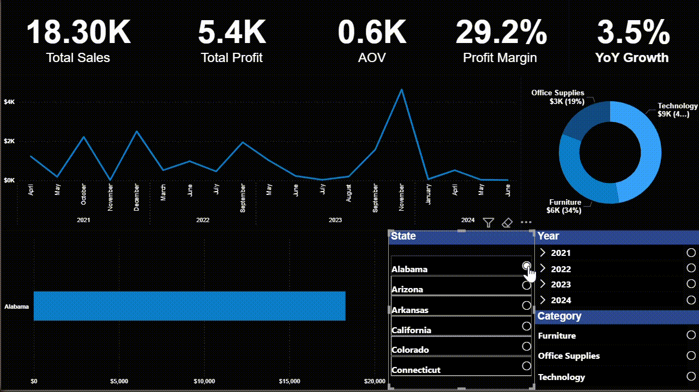

# 📊 Sales Performance Dashboard

## 🧠 Project Overview
This **Retail Sales Performance Dashboard** provides a comprehensive analysis of sales, profit, and customer behavior across multiple states and product categories.  
Built with **Power BI**, the dashboard enables interactive data exploration and performance tracking over time to support strategic business decisions.

---

## 🎯 Objective
To evaluate retail business performance by analyzing:
- Total sales and profit trends over time  
- Product category contribution to total revenue  
- State-wise performance comparison  
- Key business metrics like **AOV**, **Profit Margin**, and **YoY Growth**

---

## 🧩 Key Metrics
| Metric | Description | Insight |
|---------|--------------|----------|
| 💵 **Total Sales (1.93M)** | Total revenue generated | Shows overall business volume |
| 💰 **Total Profit (248K)** | Net profit earned | Indicates profitability across all categories |
| 🧾 **AOV (2.4K)** | Average Order Value | Measures average spend per order |
| 📈 **Profit Margin (12.9%)** | Ratio of profit to sales | Evaluates business efficiency |
| 🚀 **YoY Growth (23.4%)** | Year-over-year sales growth | Indicates expansion rate |

---

## 📅 Dashboard Components
1. **Sales Trend Line (Left-Top)**  
   - Displays monthly sales fluctuations (2021–2024).  
   - Helps identify seasonal patterns and growth trends.  

2. **Donut Chart by Category (Right-Top)**  
   - Visualizes category contribution to total sales:  
     - Technology – 37%  
     - Furniture – 32%  
     - Office Supplies – 31%  
   - Reveals top-performing product segments.

3. **State-wise Sales Bar Chart (Bottom-Left)**  
   - Compares total sales across major states.  
   - California and New York dominate revenue generation.  

4. **Interactive Filters (Right Panel)**  
   - **State, Year, Category** slicers allow focused analysis.  
   - Enables customized exploration for any region or time period.

---

## 🧮 DAX Calculations (Used in Dashboard)
```DAX
-- Profit Margin %
Profit Margin % = DIVIDE ( [Total Profit], [Total Sales] )

-- Average Order Value (AOV)
AOV = DIVIDE ( [Total Sales], [Orders] )

-- YoY Growth %
YoY Growth % = DIVIDE([Total Sales] - [Sales YoY], [Sales YoY])

--- Total Profit
Total Profit = SUM(Data[Profit])

--- Total Sales
Total Sales = SUM('Data'[Sales])
```

---

## 🌍 Insights & Findings
- **Steady Growth:** Sales show consistent upward trends from 2021–2024, with ~23% YoY increase.  
- **Top Categories:** Technology leads with the highest contribution to total sales.  
- **Profitability Variation:** Profit margins fluctuate across categories but remain healthy overall (~13%).  
- **Regional Performance:** California, New York, and Texas are key markets generating the most sales volume.

---

## 🧠 Business Impact
This analysis helps stakeholders to:
- Identify top-performing regions and categories  
- Monitor profitability and growth patterns  
- Make informed decisions about marketing and inventory investments  
- Optimize pricing and promotional strategies

---

## 📸 Dashboard Preview


---

## 🧭 How To Use
- Follow these steps to explore and interact with the **Sales Analysis Power BI Dashboard**:

1. Open Data folder.

- Open the file SALES ANALYSIS BI.pbix in Power BI Desktop.

2. Load the data

- Make sure Sales and Profit Data.xlsx is in the same directory.

- If the file path changes, go to Home → Transform Data → Data Source Settings and relink the Excel file.

3. Explore the dashboard

- Interact with visuals, slicers, and filters to analyze sales performance, profitability, and regional trends.

4.  Switch between report pages for detailed views such as:

- Yearly Sales Overview

- Product & Category Analysis

- Regional Performance

- Profit Margin Insights

---

## 👨‍💻 Author
**Muhiddin Axmadov**  
📍 Data Analyst | Power BI Developer | Business Insights Enthusiast  
